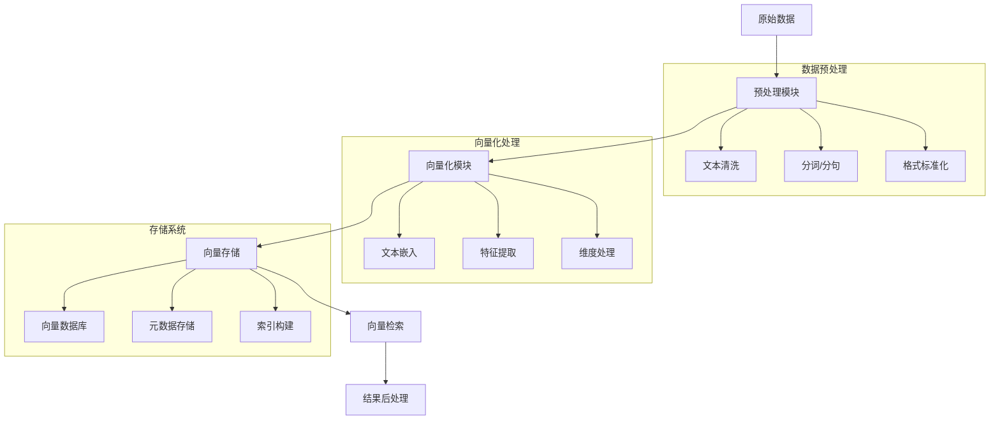
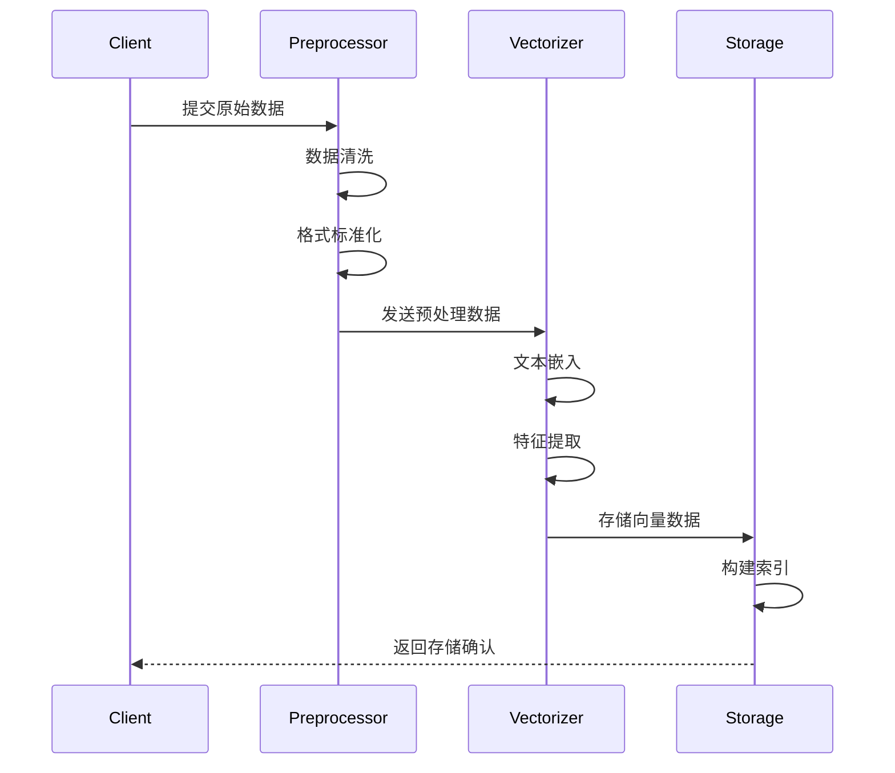
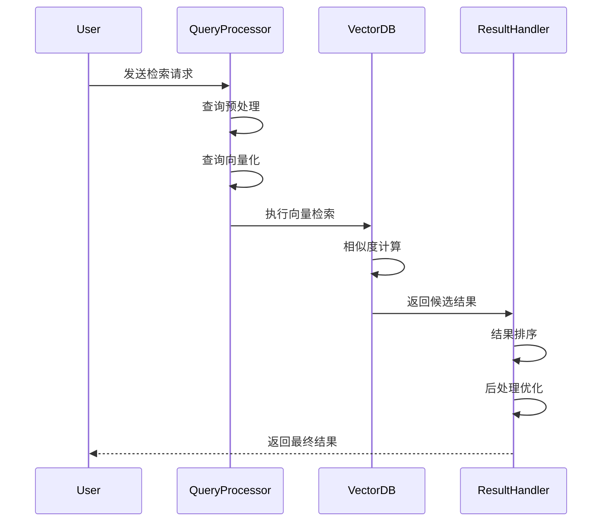
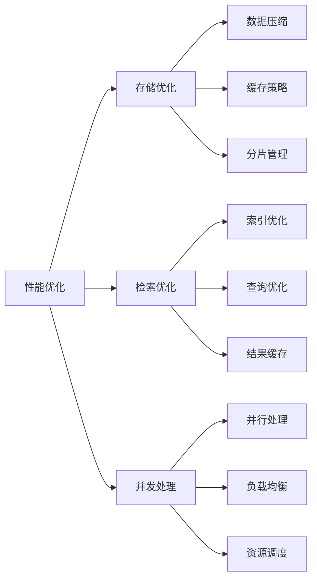
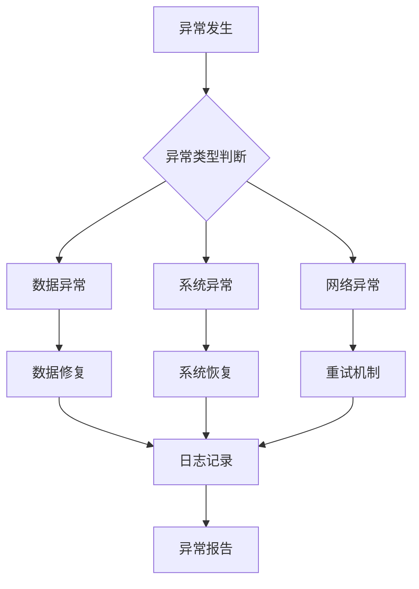

# 数据向量化存储与检索流程设计

## 1. 总体架构

### 总体架构说明
1. **数据流向**
   - 原始数据首先进入预处理模块，进行基础清洗和标准化
   - 预处理后的数据传入向量化模块，转换为向量表示
   - 向量数据存入存储系统，并建立检索索引
   - 检索系统根据查询需求检索相似向量
   - 最后对检索结果进行后处理和优化

2. **模块职责**
   - 预处理模块：确保数据质量和一致性
   - 向量化模块：将文本转换为高维向量表示
   - 存储系统：管理向量数据和元数据
   - 检索模块：提供高效的相似度搜索
   - 后处理模块：优化和过滤检索结果

## 2. 核心流程详细设计

### 2.1 数据向量化流程

### 向量化流程说明
1. **数据提交阶段**
   - Client提交原始数据，可以是单条或批量数据
   - 支持多种数据格式：文本、JSON、CSV等
   - 提供数据验证和格式检查

2. **预处理阶段**
   - 执行数据清洗，去除无效字符和噪声
   - 进行格式标准化，统一编码和表示方式
   - 数据规范化，确保质量达标

3. **向量化阶段**
   - 使用预训练模型进行文本嵌入
   - 提取关键特征，优化向量表示
   - 支持批量处理以提高效率

4. **存储阶段**
   - 向量数据持久化存储
   - 构建高效检索索引
   - 保存相关元数据信息

### 2.2 向量检索流程

### 检索流程说明
1. **查询处理阶段**
   - 接收用户查询请求，验证查询参数
   - 对查询文本进行预处理和标准化
   - 将查询转换为向量表示

2. **检索执行阶段**
   - 在向量数据库中执行ANN（近似最近邻）搜索
   - 计算查询向量与候选向量的相似度
   - 支持多种相似度计算方法（余弦相似度、欧氏距离等）

3. **结果处理阶段**
   - 对检索结果进行排序和过滤
   - 应用业务规则和权重调整
   - 结果格式化和封装

4. **性能优化**
   - 使用缓存加速常见查询
   - 支持异步处理和并行计算
   - 实现结果分页和流式返回

## 4. 性能优化设计

### 4.1 系统性能优化

### 性能优化说明
1. **存储优化策略**
   - 实现数据压缩以减少存储空间
   - 采用多级缓存策略提升访问速度
   - 实现数据分片管理，支持横向扩展

2. **检索优化策略**
   - 优化索引结构，提升检索效率
   - 实现查询计划优化，选择最优执行路径
   - 使用结果缓存，加速热点查询

3. **并发处理优化**
   - 实现并行处理框架，提高吞吐量
   - 采用负载均衡策略，优化资源利用
   - 实现智能资源调度，动态分配计算资源

## 5. 异常处理机制

### 5.1 异常处理流程

### 异常处理说明
1. **异常分类处理**
   - 数据异常：包括格式错误、数据损坏等
   - 系统异常：包括资源不足、服务崩溃等
   - 网络异常：包括连接超时、网络中断等

2. **处理策略**
   - 数据修复：尝试自动修复或请求人工干预
   - 系统恢复：自动重启服务或切换备用节点
   - 重试机制：实现退避策略的重试机制

3. **监控和报告**
   - 实时监控系统状态和异常事件
   - 记录详细的错误日志和上下文信息
   - 生成异常报告并通知相关人员

4. **预防措施**
   - 实现健康检查机制
   - 设置合理的告警阈值
   - 定期进行系统维护和优化