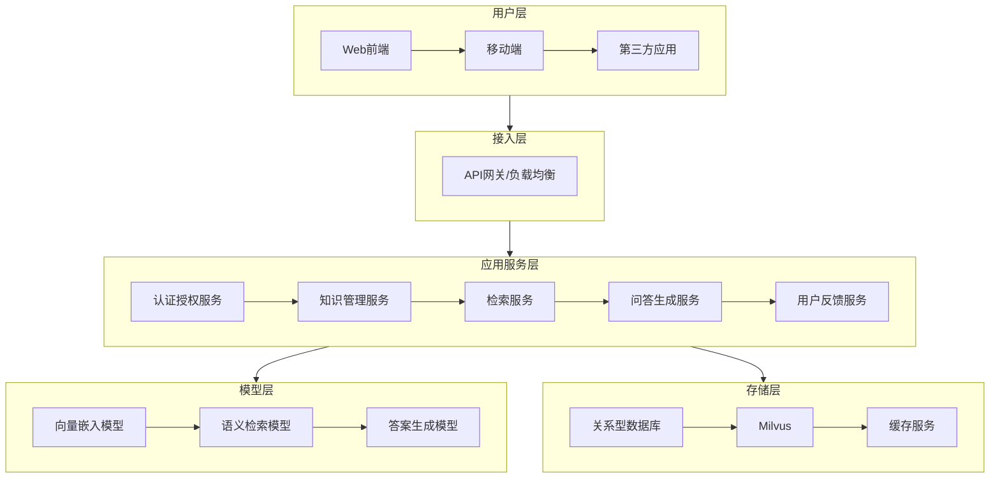
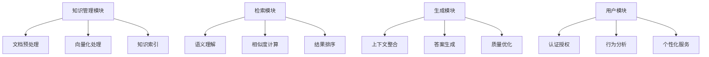
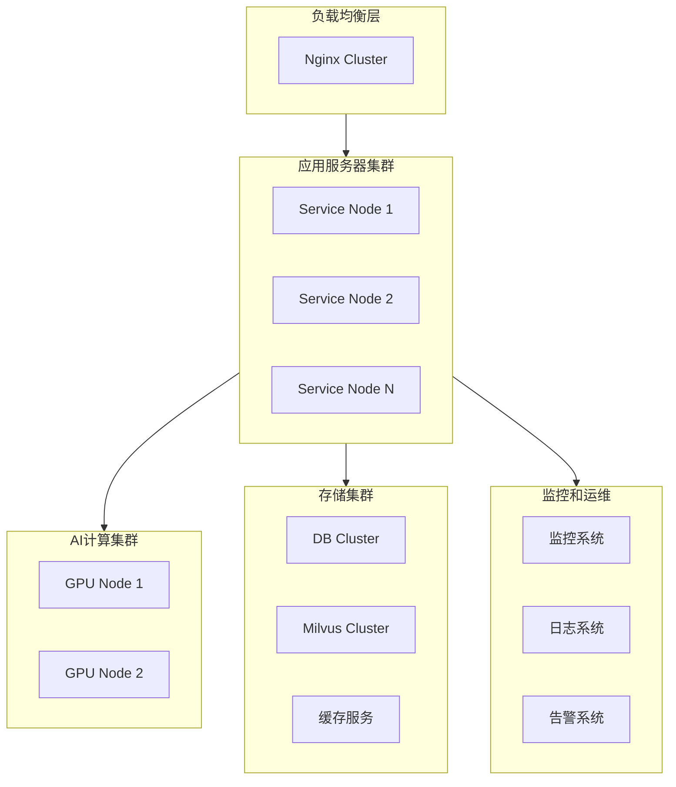
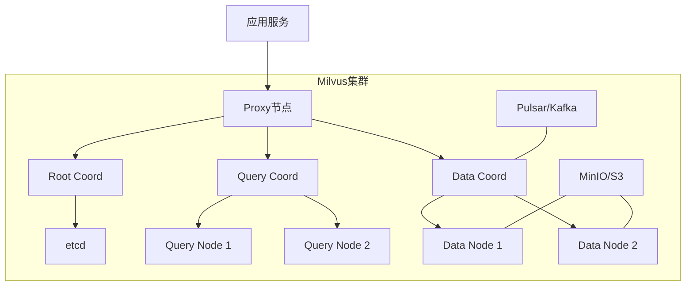
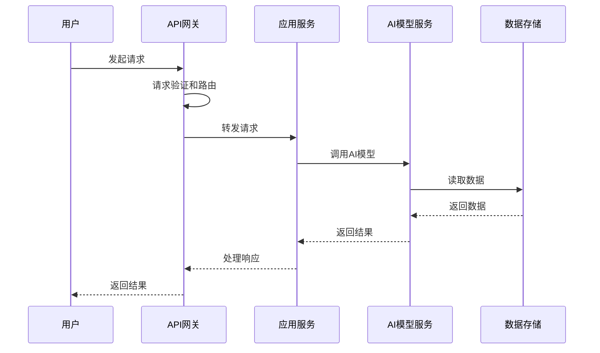
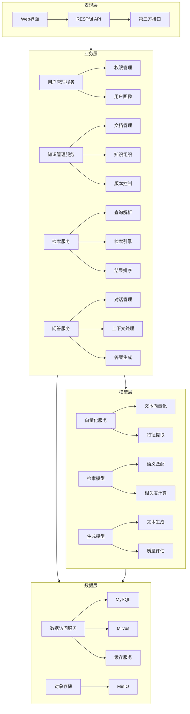

# AI知识库系统架构设计文档

## 1. 系统架构概述

### 1.1 总体架构图

### 1.2 架构设计原则
- 高内聚低耦合：各模块功能独立，接口清晰
- 可扩展性：支持水平扩展和功能模块扩展
- 高可用性：关键服务多副本部署，故障自动转移
- 安全性：多层次安全防护，数据加密传输
- 可维护性：统一监控、日志和告警体系

## 2. 技术架构

### 2.1 技术栈选型

#### 2.1.1 后端技术栈
- 开发框架：Spring Boot 2.7.x
- 微服务框架：Spring Cloud Alibaba
- API网关：Spring Cloud Gateway
- 服务注册与发现：Nacos
- 负载均衡：Nginx + Ribbon
- 服务熔断：Sentinel
- 分布式事务：Seata
- 消息队列：RocketMQ
- 日志收集：ELK Stack

#### 2.1.2 存储技术栈
- 关系型数据库：MySQL 8.0
- Milvus：用于存储和检索文档向量
  - 优势：
    - 专门为向量检索设计的分布式数据库
    - 支持多种索引类型和距离计算方法
    - 高性能和可扩展性
    - 支持实时插入和近实时搜索
    - 丰富的SDK和工具支持
    - 活跃的开源社区
  - 相比 Elasticsearch 的优点：
    - 更轻量级，部署和维护更简单
    - 内存数据库，检索性能更好
    - 资源占用更少，适合中小规模应用
    - 配置更简单，学习曲线更平缓
    - 单机部署即可满足大部分需求
    - 与 Redis 生态完美集成，可复用现有缓存层
  - 用途：
    - 向量存储
    - 相似度检索
    - 缓存
- 缓存服务：Redis Cluster
- 对象存储：MinIO

#### 2.1.3 AI模型技术栈
- 深度学习框架：PyTorch
- 向量嵌入：Sentence-BERT
- 向量检索：FAISS
- 大语言模型：LangChain集成

#### 2.1.4 前端技术栈
- 框架：React 18
- 状态管理：Redux
- UI组件库：Ant Design
- 构建工具：Webpack
- 包管理：pnpm

### 2.2 系统模块架构

## 3. 部署架构

### 3.1 物理部署架构图

### 3.2 存储层部署架构

#### 3.2.1 MySQL集群部署
{{ ... }}

#### 3.2.2 Milvus集群部署

Milvus采用分布式架构部署：
- Proxy节点：负责请求转发和负载均衡
- Coordinator节点：
  - Root Coord：管理元数据
  - Query Coord：管理查询任务
  - Data Coord：管理数据节点
- Query Node：执行向量检索
- Data Node：管理向量数据
- 依赖服务：
  - etcd：存储元数据
  - MinIO：存储向量数据
  - Pulsar：消息队列，支持日志订阅

#### 3.2.3 Redis缓存集群
{{ ... }}

### 3.3 容器化部署方案
- 容器编排：Kubernetes
- 服务网格：Istio
- 容器仓库：Harbor
- 配置中心：Nacos
- CI/CD：Jenkins + GitLab

## 4. 运行架构

### 4.1 系统运行流程

### 4.2 关键流程说明

#### 4.2.1 文档入库流程
1. 文档上传与验证
2. 文本提取与预处理
3. 文档分块与向量化
4. 向量索引构建
5. 元数据存储

#### 4.2.2 知识检索流程
1. 查询预处理
2. 语义向量转换
3. 相似度检索
4. 结果重排序
5. 答案生成

## 5. 逻辑架构

### 5.1 逻辑架构图

### 5.2 系统分层

#### 5.1.1 表现层
- Web界面
- RESTful API
- 第三方接口

#### 5.1.2 业务层
- 用户管理
- 知识管理
- 检索服务
- 问答服务

#### 5.1.3 模型层
- 向量化服务
- 检索服务
- 生成服务

#### 5.1.4 数据层
- 数据访问
- 缓存处理
- 存储管理

### 5.2 核心模块职责

#### 5.2.1 知识管理模块
- 文档管理
- 知识组织
- 索引维护

#### 5.2.2 检索模块
- 查询理解
- 相似度计算
- 结果排序

#### 5.2.3 生成模块
- 上下文理解
- 答案生成
- 质量控制

## 6. 关键技术实现

### 6.1 向量检索技术
- 采用HNSW算法
- 支持实时索引更新
- 优化召回准确率

### 6.2 知识融合技术
- 多源知识整合
- 知识图谱构建
- 语义关联分析

### 6.3 答案生成技术
- 基于检索增强的生成
- 多轮对话管理
- 答案质量评估

## 7. 系统安全设计

### 7.1 安全架构
- 身份认证
- 访问控制
- 数据加密
- 审计日志

### 7.2 数据安全
- 传输加密
- 存储加密
- 备份恢复
- 敏感信息保护

## 8. 性能设计

### 8.1 性能指标
- 响应时间：平均<1s
- 并发用户：1000+
- 系统吞吐量：1000+ QPS
- 检索准确率：Top5>90%

### 8.2 性能优化策略
- 多级缓存
- 异步处理
- 负载均衡
- 资源弹性扩展

## 9. 可用性设计

### 9.1 高可用方案
- 服务冗余部署
- 故障自动转移
- 限流和降级
- 监控告警

### 9.2 灾备方案
- 多地域部署
- 数据实时同步
- 故障恢复预案

## 10. 扩展性设计

### 10.1 水平扩展
- 服务无状态化
- 数据分片策略
- 弹性伸缩方案

### 10.2 垂直扩展
- 模块化设计
- 插件化架构
- 服务治理

## 11. Milvus性能优化和运维

### 11.1 向量检索优化

#### 11.1.1 Milvus索引优化
- 选择合适的索引类型：
  - IVF_FLAT：适用于中等规模数据集，平衡查询性能和准确性
  - IVF_SQ8：节省存储空间，适用于大规模数据集
  - HNSW：高精度检索需求，支持实时插入
- 索引参数调优：
  - nlist：聚类中心数量
  - nprobe：搜索聚类数量
  - ef_construction：建索引质量参数
  - ef_search：搜索质量参数

#### 11.1.2 查询性能优化
- 批量插入和查询
- 合理设置向量维度
- 动态负载均衡
- 查询缓存策略
- 异步操作处理

### 11.2 系统监控

#### 11.2.1 Milvus监控指标
- 系统指标：
  - CPU使用率
  - 内存使用率
  - 磁盘I/O
  - 网络流量
- 业务指标：
  - QPS
  - 查询延迟
  - 插入速率
  - 检索准确率
- 资源指标：
  - 集合数量
  - 分区数量
  - 向量总数
  - 存储空间使用率

#### 11.2.2 告警策略
- 性能告警：
  - 查询延迟超阈值
  - QPS异常波动
  - 资源使用率过高
- 容量告警：
  - 存储空间不足
  - 内存使用率过高
- 可用性告警：
  - 节点离线
  - 服务不可用
  - 连接异常

### 11.3 运维管理

#### 11.3.1 数据备份策略
- 定时全量备份
- 增量备份
- 元数据备份
- 多副本存储

#### 11.3.2 扩容方案
- 水平扩展：
  - 增加Query Node
  - 增加Data Node
  - 分片策略调整
- 垂直扩展：
  - 升级节点配置
  - 优化资源分配

#### 11.3.3 故障恢复
- 故障检测
- 自动故障转移
- 数据恢复流程
- 服务降级策略