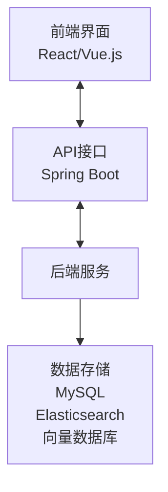

### 系统详细设计文档（修订版）

#### 1. 引言
- **目标**：设计并实现一个基于RAG（检索增强生成）架构的知识问答系统，使用Spring Boot技术栈，并集成嵌入模型和向量数据库。
- **范围**：系统包括数据存储、检索模块、生成模块、API接口和前端界面。

#### 2. 系统架构
- **技术栈**：
  - **后端**：Spring Boot
  - **数据库**：MySQL/PostgreSQL（关系型数据库），Elasticsearch（知识库），向量数据库（如Pinecone、Vespa）
  - **自然语言处理**：Hugging Face Transformers（预训练语言模型）
  - **嵌入模型**：Sentence-BERT、FAISS
  - **前端**：React/Vue.js
- **架构图**：

#### 3. 数据存储与管理
- **关系型数据库**：
  - 存储用户信息、问答记录、系统日志等。
  - 使用MySQL或PostgreSQL。
- **Elasticsearch知识库**：
  - 存储大量的文档和知识。
  - 使用Elasticsearch的Java客户端进行高效的文档检索。
- **向量数据库**：
  - 存储文档和问题的嵌入向量。
  - 使用Pinecone、Vespa等向量数据库。

#### 4. 嵌入模型
- **功能**：将文档和问题转换为高维向量，便于后续的相似度计算和检索。
- **实现**：
  - 使用Sentence-BERT等嵌入模型生成向量。
  - 将生成的向量存储到向量数据库中。

#### 5. 检索模块
- **功能**：根据用户的问题从向量数据库中检索最相似的文档。
- **实现**：
  - 使用FAISS等向量检索库进行高效的相似度计算。
  - 实现一个检索服务，处理查询请求并返回最相似的文档。

#### 6. 生成模块
- **功能**：将检索到的文档与问题结合，生成最终的回答。
- **实现**：
  - 使用预训练的语言模型（如BERT、GPT-3）进行文本生成。
  - 使用Hugging Face的Transformers库来集成这些模型。
  - 实现一个生成服务，处理生成请求并返回生成的回答。

#### 7. API接口
- **功能**：提供RESTful API接口，供前端或其他系统调用。
- **实现**：
  - 使用Spring Boot提供API接口。
  - 实现用户认证和授权机制，确保系统的安全性。

#### 8. 前端界面
- **功能**：提供用户友好的问答界面。
- **实现**：
  - 使用React或Vue.js等前端框架。
  - 实现与后端API的互动，展示问答结果。

#### 9. 安全性
- **用户认证**：使用JWT（JSON Web Token）进行用户认证。
- **数据加密**：对敏感数据进行加密存储。
- **访问控制**：实现基于角色的访问控制（RBAC）。

#### 10. 性能优化
- **缓存**：使用Redis进行缓存，减少数据库和向量数据库的查询压力。
- **负载均衡**：使用Nginx进行负载均衡，提高系统的并发处理能力。
- **异步处理**：使用Spring的异步任务处理机制，提高系统的响应速度。

#### 11. 部署与运维
- **容器化**：使用Docker进行容器化部署。
- **持续集成/持续部署（CI/CD）**：使用Jenkins/GitHub Actions进行CI/CD。
- **监控与日志**：使用Prometheus和Grafica进行系统监控，使用ELK（Elasticsearch, Logstash, Kibana）进行日志管理。

#### 12. 测试
- **单元测试**：使用JUnit进行单元测试。
- **集成测试**：使用Spring Boot Test进行集成测试。
- **性能测试**：使用JMeter进行性能测试。

#### 13. 未来工作
- **模型优化**：持续优化和更新预训练语言模型，提高生成回答的质量。
- **多语言支持**：增加对多语言的支持。
- **智能推荐**：增加智能推荐功能，根据用户的历史行为推荐相关问题和答案。

### 结论
这份修订版的详细设计文档提供了一个RAG AI系统的全面设计和实现方案，特别强调了嵌入模型和向量数据库的使用。通过使用Spring Boot技术栈，结合Elasticsearch、向量数据库和预训练语言模型，可以构建一个高效、准确的知识问答系统。希望这份文档能为你的项目提供有价值的参考。